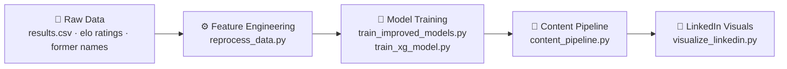

<div align="center">

# ⚽ FIFA World Cup 2026 — Match Predictor

**An end-to-end machine learning pipeline** that predicts match outcomes, expected goals (xG), and most likely scores for the FIFA World Cup 2026 — with automated LinkedIn-ready visualizations for daily social sharing.

<br>


<br>

[🌟 Features](#-features) • [📊 Sample Predictions](#-sample-predictions) • [🧠 How It Works](#-how-it-works) • [🛠️ Tech Stack](#️-tech-stack) • [🚀 Quick Start](#-quick-start) • [🗂️ Project Structure](#️-project-structure)

</div>

<br>

---

<br>

<div align="center">

## 🌟 Features

<br>

<table>
<tr>
<td width="33%" align="center">
<h3>🏆 Win/Draw/Loss</h3>
<p>XGBoost classifier trained on <b>43K+ historical matches</b> predicts outcome probabilities with multi-class softmax.</p>
</td>
<td width="33%" align="center">
<h3>🎯 Expected Goals (xG)</h3>
<p>Dual Poisson regressors model home & away scoring rates using <b>18 engineered features</b> per match.</p>
</td>
<td width="33%" align="center">
<h3>📊 Score Simulation</h3>
<p>Poisson probability matrix computes the <b>most likely exact score</b> from predicted xG values.</p>
</td>
</tr>
<tr>
<td width="33%" align="center">
<h3>📅 Daily Pipeline</h3>
<p>Automated content generation creates <b>prediction posts</b> and LinkedIn captions for every match day.</p>
</td>
<td width="33%" align="center">
<h3>📈 LinkedIn Visuals</h3>
<p>Professional 16:9 <b>bar charts & heatmaps</b> designed for social media sharing at 150 DPI.</p>
</td>
<td width="33%" align="center">
<h3>🔄 Live Updates</h3>
<p>Update <b>results.csv</b> → reprocess features → retrain models → new predictions in minutes.</p>
</td>
</tr>
</table>

</div>

<br>

---

<br>

## 📊 Sample Predictions

<div align="center">

### June 12, 2026 — FIFA World Cup Group Stage

<br>

<table>
<tr>
<th align="center">Match</th>
<th align="center">Prediction Breakdown</th>
<th align="center">Most Likely Score</th>
</tr>
<tr>
<td align="center"><b>🇨🇦 Canada</b> vs 🇧🇦 Bosnia</td>
<td align="center"><b>78.9%</b> · 14.9% · 6.2%</td>
<td align="center"><b>2 – 0</b></td>
</tr>
<tr>
<td align="center"><b>🇺🇸 United States</b> vs 🇵🇾 Paraguay</td>
<td align="center"><b>57.0%</b> · 30.4% · 12.6%</td>
<td align="center"><b>1 – 0</b></td>
</tr>
<tr>
<td colspan="3" align="center"><sub>Probabilities: Home Win · Draw · Away Win</sub></td>
</tr>
</table>

<br>

### Outcome Probability Chart


<br>

### Score Distribution Heatmap


</div>

<br>

---

<br>

## 🧠 How It Works



<br>

### Data Processing
Historical match data spanning **1872–2026** is cleaned, team names are standardized (e.g., *Soviet Union* → *Russia*, *Czechoslovakia* → *Czech Republic*), and **rolling 5-match features** are computed for every team:

> **Form Points** · Goals Scored · Goals Conceded · Goal Difference · Wins · Draws · Losses

Annual **Elo ratings** are merged to capture relative team strength at the time of each match.

### Model Training

Three XGBoost models are trained on a **time-based 80/20 chronological split** (no future leakage):

<div align="center">

| Model | Objective | Output | Architecture |
|-------|-----------|--------|-------------|
| **🏆 Win Classifier** | `multi:softprob` | Win / Draw / Loss probabilities | 200 estimators, depth 6, subsample 0.8 |
| **⚽ Home xG** | `count:poisson` | Home team expected goals | 100 estimators, depth 5 |
| **⚽ Away xG** | `count:poisson` | Away team expected goals | 100 estimators, depth 5 |

</div>

### Score Simulation

The most likely score is found by computing a **Poisson probability matrix**:

<br>

<div align="center">
<table>
<tr><td align="center"><code>P(home scores <b>i</b> goals | home_xg)</code></td>
<td align="center"><b>×</b></td>
<td align="center"><code>P(away scores <b>j</b> goals | away_xg)</code></td>
<td align="center"><b>=</b></td>
<td align="center"><code>Score probability matrix (6×6)</code></td></tr>
</table>
</div>

<br>

The cell with the **highest joint probability** is selected as the most likely score, with its confidence percentage displayed on the heatmap.

### Feature Vector (18 Features)

<div align="center">

| Category | Features |
|----------|----------|
| **📊 Elo** | `home_elo` · `away_elo` · `elo_difference` |
| **📈 Form** | `home/away_form_points_last5` |
| **📉 Results** | `home/away_wins_last5` · `home/away_draws_last5` · `home/away_losses_last5` |
| **⚽ Attack** | `home/away_goals_scored_last5` |
| **🛡️ Defense** | `home/away_goals_conceded_last5` |
| **🧮 Balance** | `home/away_goal_difference_last5` |
| **🏟️ Venue** | `neutral` |

</div>

<br>

---

<br>

## 🛠️ Tech Stack

<div align="center">

<table>
<tr>
<th align="center">Category</th>
<th align="center">Technology</th>
<th align="center">Purpose</th>
</tr>
<tr>
<td align="center"><b>Language</b></td>
<td align="center"></td>
<td align="center">Core programming language</td>
</tr>
<tr>
<td align="center"><b>ML Framework</b></td>
<td align="center"></td>
<td align="center">Classification & Poisson regression</td>
</tr>
<tr>
<td align="center"><b>ML Toolkit</b></td>
<td align="center"></td>
<td align="center">Baseline models, preprocessing, metrics</td>
</tr>
<tr>
<td align="center"><b>Data</b></td>
<td align="center">pandas · NumPy</td>
<td align="center">Data manipulation & numerical computing</td>
</tr>
<tr>
<td align="center"><b>Statistics</b></td>
<td align="center">SciPy</td>
<td align="center">Poisson distribution for score simulation</td>
</tr>
<tr>
<td align="center"><b>Visualization</b></td>
<td align="center">matplotlib · seaborn</td>
<td align="center">Professional charts & heatmaps</td>
</tr>
<tr>
<td align="center"><b>Notebooks</b></td>
<td align="center">Jupyter</td>
<td align="center">Exploratory analysis & presentation</td>
</tr>
<tr>
<td align="center"><b>Package Manager</b></td>
<td align="center"></td>
<td align="center">Fast dependency management</td>
</tr>
</table>

</div>

<br>

---

<br>

## 🚀 Quick Start

<div align="center">

### Prerequisites

<br>

<table>
<tr>
<td align="center"><b>Python</b></td>
<td align="center">≥ 3.13</td>
</tr>
<tr>
<td align="center"><b>uv</b></td>
<td align="center"><a href="https://docs.astral.sh/uv/">Install uv →</a></td>
</tr>
</table>

</div>

### Setup

```bash
# Clone the repository
git clone https://github.com/yourusername/fifa-2026.git
cd fifa-2026

# Install dependencies
uv sync
```

### Pipeline Commands

<div align="center">

<table>
<tr>
<th align="center">Step</th>
<th align="center">Command</th>
<th align="center">Description</th>
</tr>
<tr>
<td align="center">1</td>
<td><code>uv run python reprocess_data.py</code></td>
<td>Process raw data into features</td>
</tr>
<tr>
<td align="center">2</td>
<td><code>uv run python train_improved_models.py</code></td>
<td>Train win/draw/loss classifier</td>
</tr>
<tr>
<td align="center">3</td>
<td><code>uv run python train_xg_model.py</code></td>
<td>Train expected goals (xG) models</td>
</tr>
<tr>
<td align="center">4</td>
<td><code>uv run python predict_match.py "Brazil" "Argentina"</code></td>
<td>Predict a single match</td>
</tr>
<tr>
<td align="center">5</td>
<td><code>uv run python content_pipeline.py 2026-06-14</code></td>
<td>Generate daily prediction post</td>
</tr>
<tr>
<td align="center">6</td>
<td><code>uv run python visualize_linkedin.py</code></td>
<td>Create all LinkedIn visualizations</td>
</tr>
</table>

</div>

<br>

---

<br>

## 🗂️ Project Structure

<pre>
fifa-2026/
│
├── <b>data/</b>                          # Raw & processed data
│   ├── results.csv                # 49K+ match results (1872–2026)
│   ├── elo_ratings.csv            # Annual Elo ratings per team
│   ├── former_names.csv           # Team name mappings (e.g. USSR → Russia)
│   └── features_with_elo_v2.csv   # Generated feature set (28 columns)
│
├── <b>models/</b>                       # Trained model files
│   ├── xgboost_v1.pkl             # XGBoost win/draw/loss classifier
│   ├── xg_home_model.pkl          # Home xG Poisson regressor
│   └── xg_away_model.pkl          # Away xG Poisson regressor
│
├── <b>notebooks/</b>                    # Jupyter notebooks
│   ├── 01_exploration.ipynb       # Data exploration & EDA
│   ├── 02_feature_engineering     # Feature engineering
│   ├── 03_model_training          # Model training & validation
│   └── 04_LinkedIn_Presentation   # Presentation with visualizations
│
├── <b>content_posts/</b>               # Generated daily posts
├── <b>visualizations_linkedin/</b>     # Generated LinkedIn images
│
├── predict_match.py               # Core prediction engine
├── reprocess_data.py              # Data processing pipeline
├── train_improved_models.py       # Win/draw/loss model training
├── train_xg_model.py              # xG model training
├── content_pipeline.py            # Automated content generation
├── visualize_linkedin.py          # LinkedIn visualization generator
├── pyproject.toml                 # Project dependencies
└── README.md                      # You are here
</pre>

<br>

---

<br>

## 📅 World Cup Match Schedule

The dataset includes all **FIFA World Cup 2026** fixtures from **June 11 – June 27** (group stage):

<div align="center">

| Date | Matches |
|:----:|:--------|
| Jun 11 | Mexico vs South Africa · South Korea vs Czech Republic |
| Jun 12 | 🇨🇦 Canada vs Bosnia · 🇺🇸 USA vs Paraguay |
| Jun 13 | Qatar vs Switzerland · Brazil vs Morocco · Haiti vs Scotland · Australia vs Turkey |
| Jun 14 | Germany vs Curaçao · Ivory Coast vs Ecuador · Netherlands vs Japan · Sweden vs Tunisia |
| Jun 15–27 | Full group stage with 4–6 matches per day |

</div>

Run the pipeline for any match day:

```bash
uv run python content_pipeline.py 2026-06-14
uv run python visualize_linkedin.py "Germany" "Ivory Coast" 2026-06-14
```

<br>

---

<br>

## 📝 License

<div align="center">

This project is licensed under the **MIT License**.

<br>

---

⭐ **Star this repo** if you found it useful for your own World Cup predictions!

</div>
